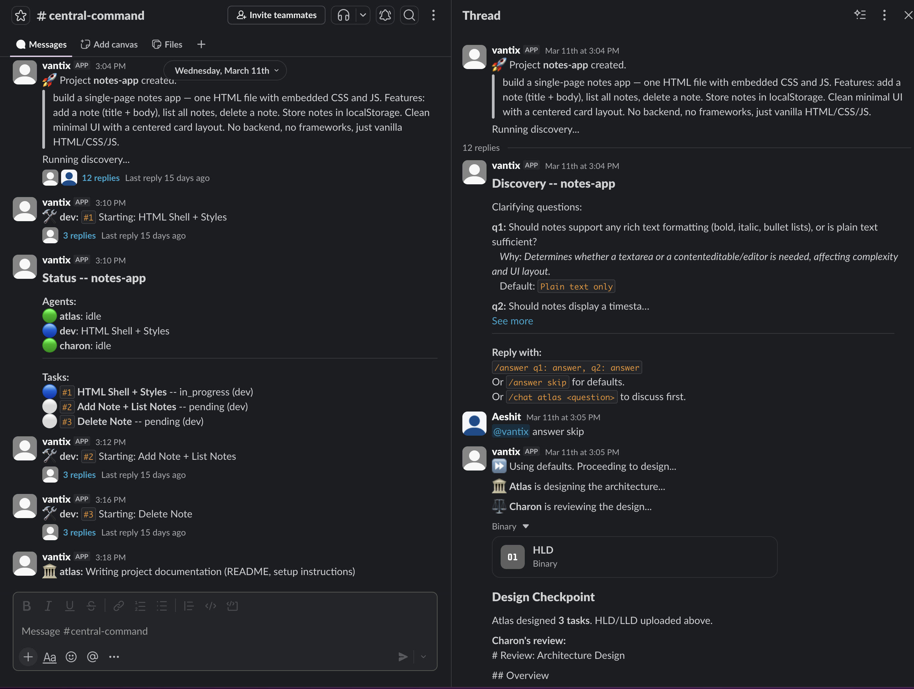
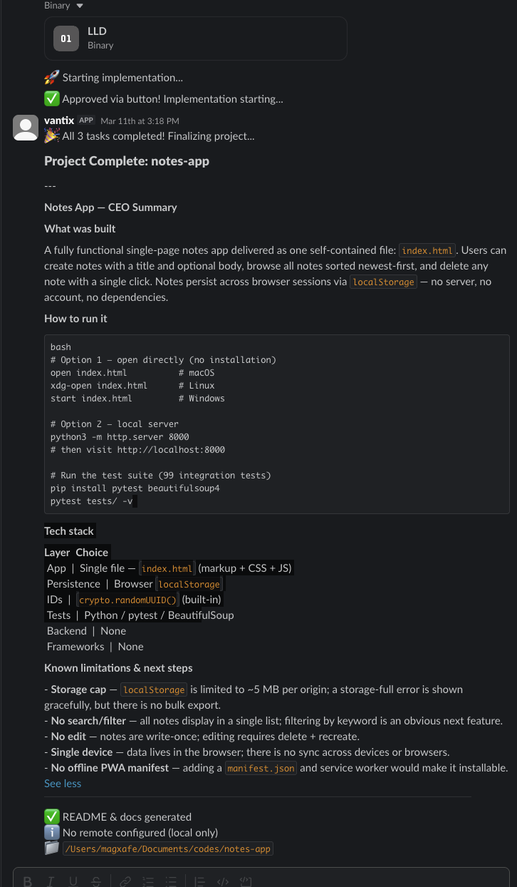
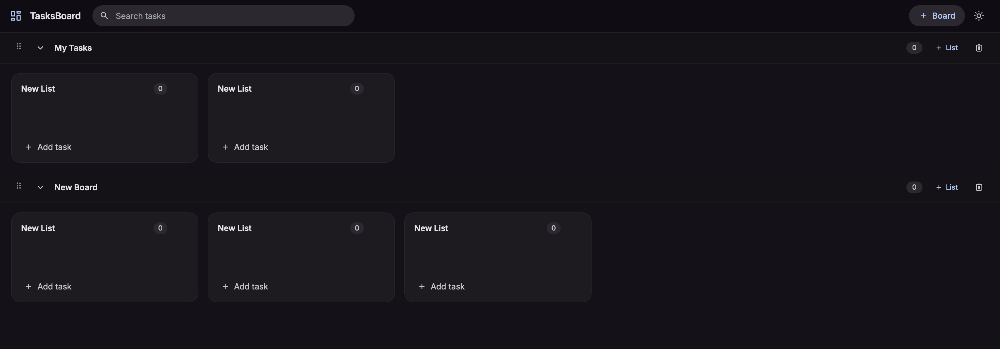

<h3>Building AI-native SaaS products, solo.</h3>

  <a href="https://github.com/aeshit">GitHub</a> ·
  <a href="#builtlike">BuiltLike</a> · <a href="#reels">Reels</a> · <a href="#vantix">Vantix</a> · <a href="#outreachpro">OutreachPro</a> · <a href="#forgekit">AI Software House</a> · <a href="#alphaflow">AlphaFlow</a> · <a href="#portfoliobot">PortfolioBot</a> · <a href="#editr">Editr</a> · <a href="#conclave">theConclave</a>

---

<h3 id="builtlike"><a href="https://builtlike.app">BuiltLike</a> — Train Like Your Heroes</h3>

Pick a hero. Follow their program. Level up.

Gamified fitness app where users choose from 9 celebrity heroes (Ronaldo, Hemsworth, Bane, Bruce Lee, Rocky, The Rock, Arnold, Mike Tyson, Virat Kohli) and follow structured workout programs. XP system with levels and badges tracks progress. 175 exercises with video demos sourced from MuscleWiki. Custom program builder for users who want their own splits. Dark-mode-first mobile UI with haptics and Lottie animations. Supabase handles auth, database, and storage — no custom backend.

`React Native` · `Expo SDK 55` · `TypeScript` · `NativeWind` · `Supabase` · `Zustand` · `TanStack Query` · `Reanimated` · `Lottie` · `Razorpay`

*Coming to Android. iOS next.*

<!--  -->

---

<h3 id="reels">Reels — See What Claude Is Thinking</h3>

Your AI has an inner monologue. Now it has a screen.

Real-time visualization tool that opens a browser window with a futuristic node graph while Claude Code works. Extracts thinking blocks from transcripts, renders file operations as glowing nodes (color-coded by tool type — cyan for reads, green for edits, orange for bash), connected by edges in a Three.js scene with bloom post-processing and orbital rings that speed up during activity. HUD overlay shows activity feed, tool stats, timer, and current reasoning text. Integrates via Claude Code hooks — zero config once installed.

`TypeScript` · `Express` · `Three.js` · `SSE` · `Claude Code Hooks`

*Plug it in. Watch Claude think.*

---

<h3 id="vantix">Vantix — Compliance Observability Suite</h3>

Companies say they follow privacy laws. This proves whether they actually do — from the outside.

External crawl engine (Playwright + mitmproxy) that audits websites and mobile apps against DPDP, CERT-In, SOC 2, and ISO 27001. Captures consent states across the full lifecycle — pre-consent, post-consent, withdrawal. LLM-powered policy analysis across 220+ rules. Evidence goes into a WORM vault with hash-chained immutability. Ships with a public company rating platform and multi-tenant dashboard (CEO, Developer, DPO, Billing personas).

`TypeScript` · `Fastify` · `tRPC` · `Next.js` · `PostgreSQL` · `TimescaleDB` · `Redis` · `BullMQ` · `Playwright` · `mitmproxy` · `Stripe` · `Razorpay` · `Clerk` · `MinIO` · `Turborepo`

*Complete. Waiting for compliance teams to care.*

<!--  -->

---

<h3 id="outreachpro">OutreachPro — Autonomous AI Sales Agent</h3>

Not a CSV email blaster — this one finds its own leads.

You give it a product description and a target audience. It discovers companies, hunts down decision-makers, researches each one, scores them 0–100, writes personalized cold emails (12 templates × 8 verticals), SMTP-verifies deliverability, checks SPF/DKIM/DMARC, and tracks ROI attribution back to USD. Pipeline is pluggable — users inject custom research nodes for domain-specific qualification. Nothing sends without inbox review first.

`Next.js` · `TypeScript` · `FastAPI` · `Python` · `PostgreSQL` · `Redis` · `Celery` · `Claude API` · `Gemini` · `SQLAlchemy` · `Pydantic` · `Hunter.io` · `Zustand`

*Finding leads while you sleep.*

<!--  -->

---

<h3 id="forgekit">AI Software House — Multi-Agent Dev Orchestrator</h3>

Built my own Claude Code before Anthropic shipped theirs.

Three agents — Atlas (architect), Dev (implementer), Charon (reviewer) — coordinate through Slack to build production apps from a text description. Tasks run in parallel via git worktrees, code gets reviewed before merge, discovery runs up to 5 rounds, agents talk to each other, and there's a daily token budget so it doesn't burn through your API credits overnight.

`Python` · `asyncio` · `FastAPI` · `Claude CLI` · `Slack` · `Docker` · `SQLAlchemy` · `SSE`

*Responsible for half this page.*

<table>
  <tr>
    <td></td>
    <td></td>
  </tr>
</table>

**Demo — TasksBoard** (built entirely by the agents from a single prompt):

---

<h3 id="alphaflow">AlphaFlow — Financial Data Engine</h3>

Built a trading bot, found out there are too many alphas.

Started as the data layer for an automated trading system. Aggregates from government regulatory databases (SEC EDGAR, SEBI, NSE), commercial APIs (YFinance, FMP), and web scraping (Firecrawl) across US and Indian markets. Normalizes market tape (8 technical indicators), fundamentals, regulatory filings (8-K, Form 4, 13F, DEF 14A for US; Reg 30, SAST, Reg 31, AGM for India), and sentiment into a single strict `ContextPacket` schema. Runs a 4-factor alpha scoring engine (momentum, smart money, sentiment, fundamental) through Gemini that produces a 0–10 composite score with AI narrative. Two-level caching drops repeat queries from 30s to 11ms. The deeper I went into signal aggregation, the clearer it became that the alpha surface was too broad to productize solo — so it lives as a clean, well-tested data engine instead.

`Python` · `FastAPI` · `Pydantic V2` · `Gemini 2.5 Flash Lite` · `yfinance` · `FMP` · `Firecrawl` · `sec-parser` · `diskcache`

*Retired as a product. Still running under the hood.*

---

<h3 id="portfoliobot">PortfolioBot — AI Portfolio Analyst</h3>

My morning newspaper, except it actually knows my portfolio and doesn't waste my time.

Telegram bot for Indian stocks (NSE). 9:05 AM briefing covers portfolio health, international/national markets, holdings analysis, and picks. Scans every 30 min during market hours — RSI, MACD, VWAP, EMA — but only pings when 2+ indicators breach simultaneously. News from 7 RSS feeds, fingerprint-deduped so the same story doesn't hit me twice in 4 hours. On-demand chat with 7 tools, FIFO lot tracking with full tax math (STCG/LTCG/STT/GST). I can log trades via text, photo, CSV, or just pasting my holdings. Dashboard lives on Vercel, syncs every 30 min. Runs on three tiers of Gemini. Whole thing costs ₹7/month.

`Python` · `Gemini` · `Next.js` · `Telegram` · `SQLite` · `APScheduler` · `aiosqlite` · `SQLAlchemy` · `Vercel`

*Wakes me up at 9:05 every morning.*

<!--  -->

---

<h3>Utilities</h3>

**[Editr](https://github.com/aeshit/editr)** — Got tired of tailoring resumes by hand.

Web app for tailoring resumes to job descriptions. Paste a JD (text or URL), AI parses it and researches the company via DuckDuckGo, generates numbered suggestion cards (NOW / NEW / WHY) I can accept, reject, or refine in plain English ("2: mention AWS, 5: shorter"). Never fabricates — only reframes existing experience. Auto-reorders skills to prioritize JD-relevant ones and weaves ATS keywords into bullet points. Generates a single-page PDF via Typst. Drafts auto-save and resume across sessions. Application tracker with drag-reorder, inline editing, round notes, and archive with outcomes. `Python · Flask · Gemini 2.5 Flash · Typst · DuckDuckGo · BeautifulSoup`

*Handles every resume I send out.*

**[theConclave](https://github.com/aeshit/theConclave)** — Two AIs walk into a room and argue about SaaS ideas.

Gemini does the research (web-grounded via Google Search), Claude passes judgment. 7-phase scan pipeline spits out 3–6 ideas per run across 14 verticals and 5 themes. Deep research mode runs an 8-step dossier on any single idea — market sizing, competitor analysis, technical feasibility, regulatory landscape, monetization strategy, risk assessment, execution roadmap, and final verdict. Scores on 5 weighted axes, learns from its own rejections so it stops suggesting the same things, and dedupes across runs. Mobile-first web dashboard for browsing results and triggering new scans. `TypeScript · Gemini · Claude · SQLite · Vite · React`

*Still running. Still arguing.*
